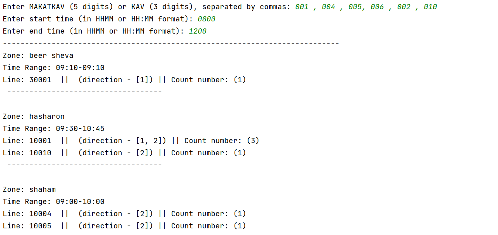

# searchandsort.py 

## Example

Suppose we have an Excel file named events.xlsx with the following data:

| area       | date | time | kav | makatkav | direction |
|------------|------|------|-----|----------|-----------|
| beer sheva | 14   | 0830 | 007 | 10007    | 1         |
| beer sheva | 14   | 0900 | 008 | 10008    | 1         |
| beer sheva | 14   | 0900 | 015 | 10015    | 2         |
| beer sheva | 14   | 0900 | 017 | 10017    | 1         |
| beer sheva | 14   | 0910 | 016 | 10016    | 1         |
| beer sheva | 14   | 1230 | 006 | 10006    | 2         |
| hasharon   | 14   | 1000 | 001 | 10001    | 1         |
| hasharon   | 14   | 0830 | 003 | 10003    | 1         |
| hasharon   | 14   | 0830 | 011 | 10011    | 2         |
| hasharon   | 14   | 0900 | 012 | 10012    | 1         |
| hasharon   | 14   | 0915 | 009 | 10009    | 1         |
| hasharon   | 14   | 0930 | 010 | 10010    | 2         |
| hasharon   | 14   | 1030 | 001 | 10001    | 2         |
| hasharon   | 14   | 1045 | 001 | 10001    | 2         |
| shaham     | 14   | 0830 | 014 | 10014    | 2         |
| shaham     | 14   | 0900 | 004 | 10004    | 2         |
| shaham     | 14   | 0930 | 013 | 10013    | 2         |
| shaham     | 14   | 1000 | 005 | 10005    | 2         |

# EXAMPLE 

## Input of user :

#### Enter MAKATKAV (5 digits) or KAV (3 digits), separated by commas:  001 , 002 , 003 , 004 , 005 , 006
---
#### Enter start time (in HHMM or HH:MM format): 08:00
---
#### Enter end time (in HHMM or HH:MM format): 12:00

---
---
---
## Output : 

## Zone: hasharon

#### Time Range: 08:30-10:45
---
#### Line: 10001  ||  (direction - [1, 2]) || Count number: (3)
---
#### Line: 10003  ||  (direction - [1]) || Count number: (1)
  
---
---

## Zone: shaham

#### Time Range: 09:00-10:00
---
#### Line: 10004  ||  (direction - [2]) || Count number: (1)
---
#### Line: 10005  ||  (direction - [2]) || Count number: (1)

---
---
---
### ALERT - The following KAVs were not found in the filtered data: 002, 006

